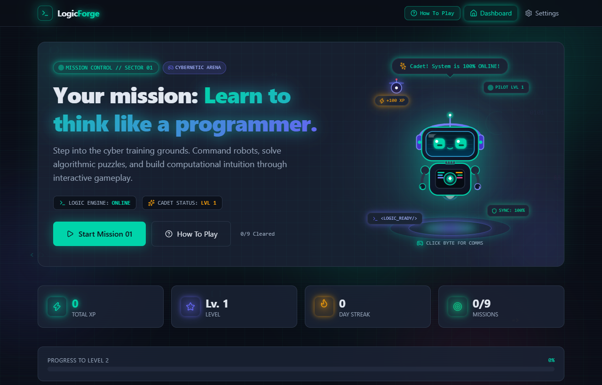
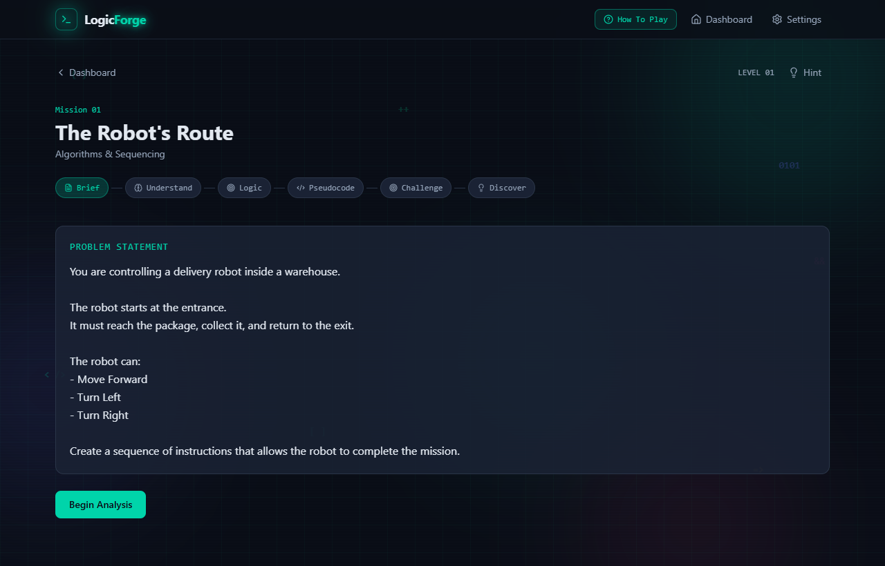
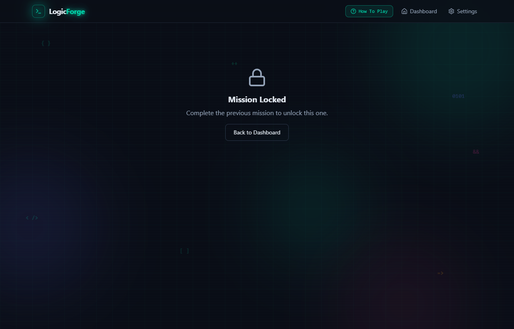

# LogicForge

[](https://react.dev/)
[](https://www.typescriptlang.org/)
[](https://vitejs.dev/)
[](https://tailwindcss.com/)
[](LICENSE)
[](https://github.com/precious-05/Logic_Forge)

A gamified, interactive educational platform designed for absolute beginners to develop computational thinking and algorithmic intuition before writing a single line of traditional code.

---

## Visual Preview

### Mission Control Dashboard


### Tactical Robot Arena & Algorithm Sequencing


### Multi-Phase Guided Learning (Problem Analysis & Pseudocode)


---

## Core Philosophy

Traditional programming courses often overwhelm beginners with syntax errors, compilers, and semicolons before teaching how to break down problems. 

LogicForge flips the model:
1. **Understand First:** Identify inputs, outputs, and constraints before touching logic.
2. **Build the Flow:** Construct flowchart-style logic blocks to verify sequential dependency.
3. **Draft Pseudocode:** Translate logic into structured English statements with flexible syntax validation.
4. **Execute & Test:** Command robots, debug programs, and run unit tests in interactive game environments.
5. **Discover the Concept:** Formalize the programming concept (Algorithms, Loops, Conditionals, Variables) after experiencing it.

---

## Curriculum Overview (Level 01: Think Like a Programmer)

| Mission | Title | Core Concept | Challenge Type |
| :--- | :--- | :--- | :--- |
| **01** | The Robot's Route | Algorithms & Sequential Directions | Grid Navigation |
| **02** | The Problem Brief | Inputs, Outputs & Problem Analysis | Input / Output Matching |
| **03** | Input / Output Lab | Operations & Data Transformation | Formula Modeling |
| **04** | Order Matters | Execution Order & Prerequisites | Recipe Sequence Reordering |
| **05** | Find the Bug | Logical Debugging & Value Tracing | 2-Step Bug Identification |
| **06** | The Branching Path | Conditionals (IF / ELSE) & Booleans | Decision Flow Builder |
| **07** | The Repeating Pattern | Loops & Pattern Recognition | Loop Structure Matcher |
| **08** | Memory Vault | Variables, Mutation & State | State Tracking |
| **FINAL** | The Logic Core | Integrated Capstone (Smart Parking) | Multi-Case Test Suite |

---

## Key Features

* **Interactive Robot Simulation:** 5x5 tactical grid with animated robot character, directional relative heading controls, package pickup mechanics, and exit portals.
* **Cadet Field Manual (Tutorial):** Integrated interactive modal with automated step-by-step simulation demonstration and manual practice sandbox.
* **Flexible Pseudocode Engine:** Intelligent whitespace normalization, quote stripping, and optional assignment parsing that evaluates logic without punishing syntax typos.
* **Gamification System:** XP points, pilot levels, progress streaks, unlockable achievements, and progressive hints.
* **Persistence:** Client-side state saved automatically to local storage with reset capabilities.
* **Cinematic Video Showcase Reel:** Built-in interactive 60 FPS video player (`/showcase-video.html`) with dynamic camera pans, particle overlays, live robot execution, and one-click WebM video export.
* **Educator Manual:** Complete solution manual provided in `TEACHER_SOLUTIONS_MANUAL.md` for classroom and teacher reference.

---

## Project Structure

```text
Logic_Forge/
├── docs/
│   └── screenshots/              # Real application capture images
├── public/                       # Favicons, vector icons, and static assets
├── scripts/
│   └── serve-and-capture.mjs     # Headless screenshot generation utility
├── src/
│   ├── assets/                   # Images and vector artwork
│   ├── components/
│   │   ├── challenges/           # Challenge engines (RobotGrid, Debug, Variables, etc.)
│   │   ├── hero/                 # Cartoon mascot and hero section components
│   │   ├── layout/               # Header, ambient cyber background, and layout shells
│   │   ├── mission/              # Multi-phase wrappers (Understand, Logic, Pseudocode, Complete)
│   │   └── ui/                   # Reusable UI library (Button, Card, Modal, ProgressBar, etc.)
│   ├── context/                  # ProgressContext and game state provider
│   ├── data/
│   │   ├── achievements.ts       # Achievement badges and unlock conditions
│   │   └── levels/               # Level definitions, problem statements, and test suites
│   ├── hooks/                    # Custom game progress hooks and scoring utilities
│   ├── pages/                    # Dashboard, MissionPage, and SettingsPage
│   ├── types/                    # TypeScript interfaces and game schemas
│   ├── utils/                    # Simulation helpers and string normalizers
│   ├── App.tsx                   # Main route configuration
│   ├── index.css                 # Cyberpunk neon theme, keyframe animations, and styling
│   └── main.tsx                  # Application entry point
├── TEACHER_SOLUTIONS_MANUAL.md   # Instructor reference and answer key
├── package.json
├── tsconfig.json
└── vite.config.ts
```

---

## Getting Started

### Prerequisites
* Node.js (v18.0.0 or higher)
* npm (v9.0.0 or higher)

### Installation

```bash
# Clone repository
git clone https://github.com/precious-05/Logic_Forge.git

# Navigate to project directory
cd Logic_Forge

# Install dependencies
npm install
```

### Development Server

```bash
npm run dev
```

The application will be accessible at `http://localhost:5173`.

### Production Build

```bash
# Type check and build bundle
npm run build

# Preview production build locally
npm run preview
```

### Code Quality & Linting

```bash
npm run lint
```

---

## Instructor Resources

A complete answer key and curriculum companion is included in the project root:
* [TEACHER_SOLUTIONS_MANUAL.md](TEACHER_SOLUTIONS_MANUAL.md): Contains question solutions, block orders, pseudocode lines, robot paths, and common student misconceptions for each mission.

---

## License

This project is open-source and available under the [MIT License](LICENSE).
